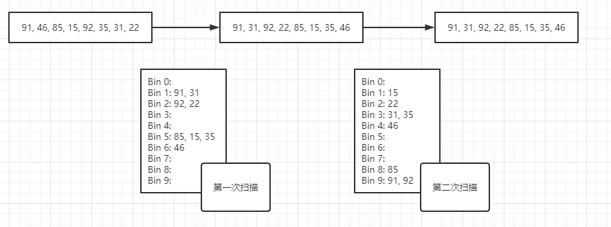

## 算法
### 一、队列
1. 特性：先进先出（FIFO）
2. 队列的实现：
    + 基于数组实现
    + 基于链表实现
3. 队列的应用
    + 基数排序：使用10个队列代表0-9十个数字，对0-99内的数字基数排序，共需要扫描两次，第一次取出每
      个数字的个位数，插入对应数字的队列中去，按0-9的顺序将队列中的数字取出，得到第一次排序结果。再
      取出每个数字的十位上的数值，以同样的方式插入队列中，再取出后即为排列好的数字列表。下面用图
      表示：
```js
a
```
